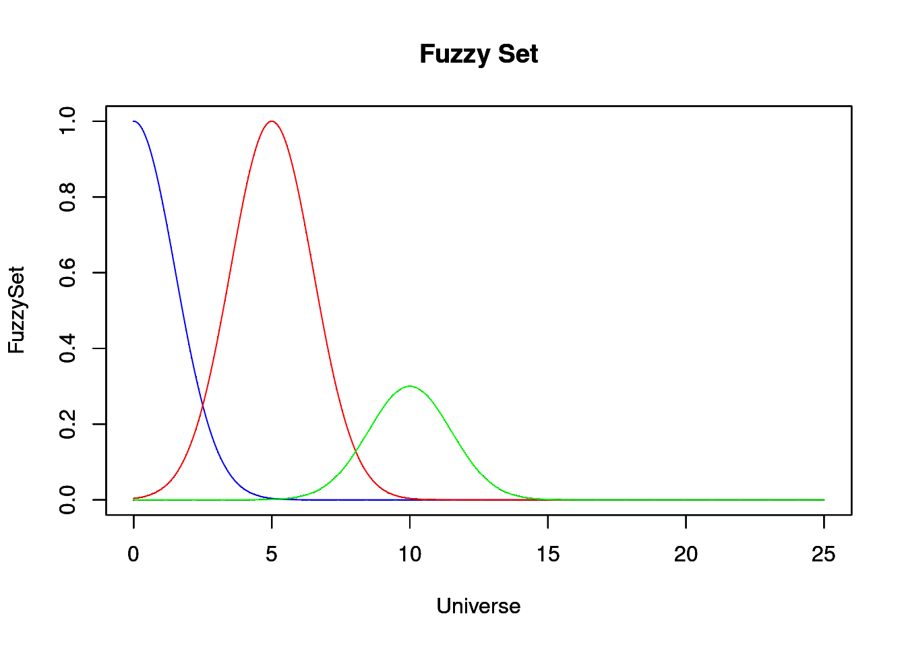
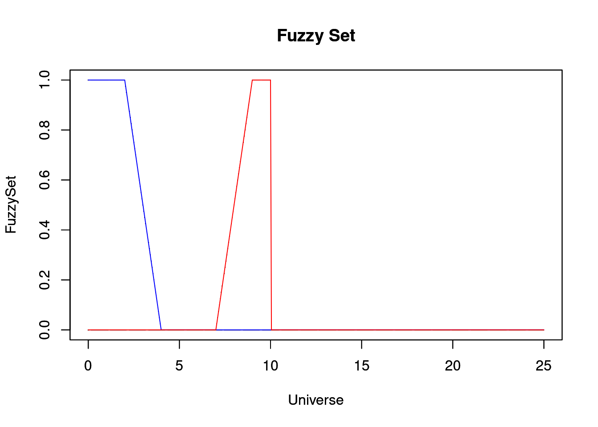
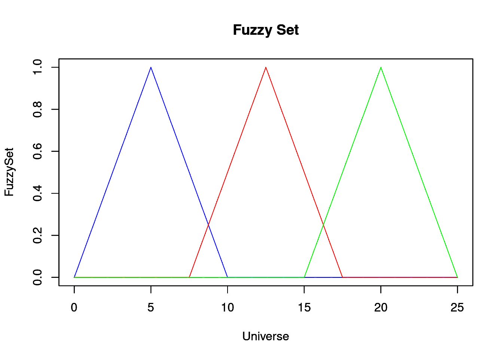
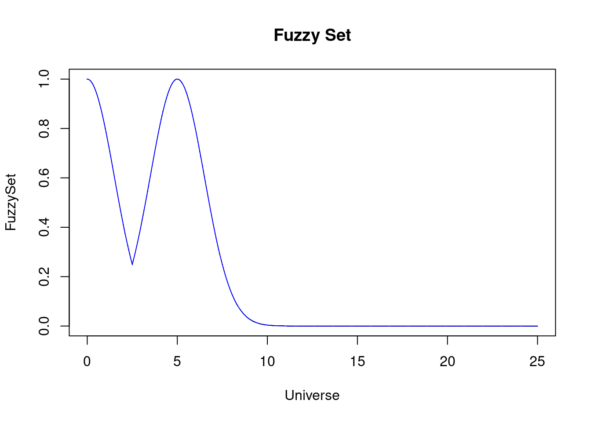
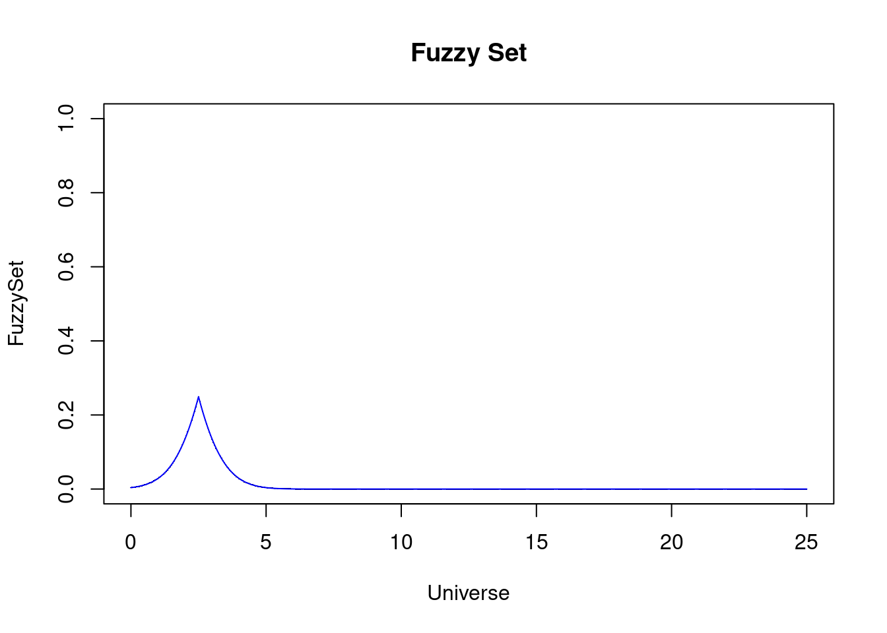
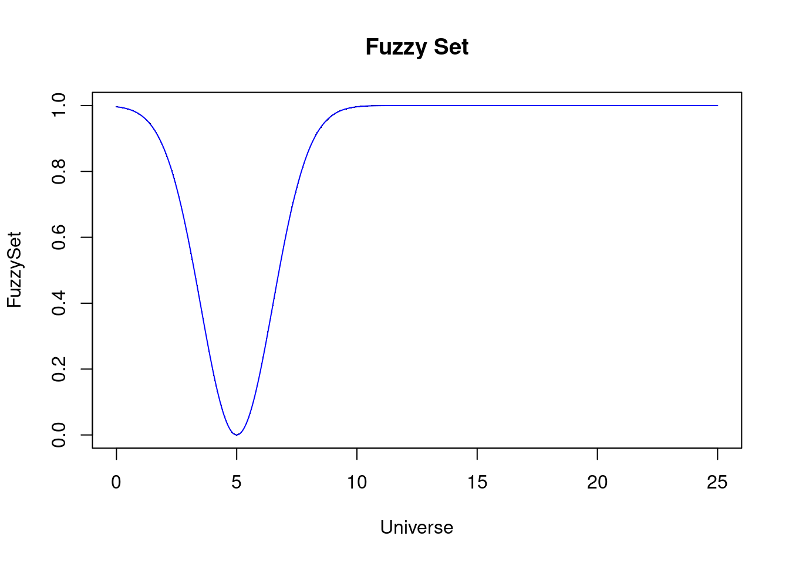
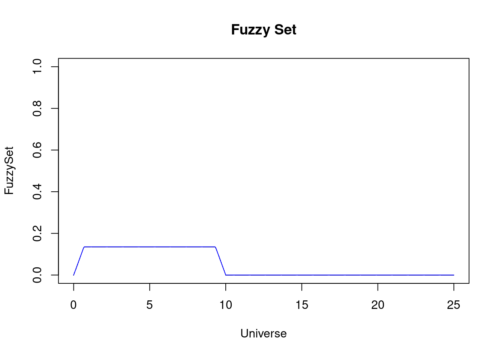
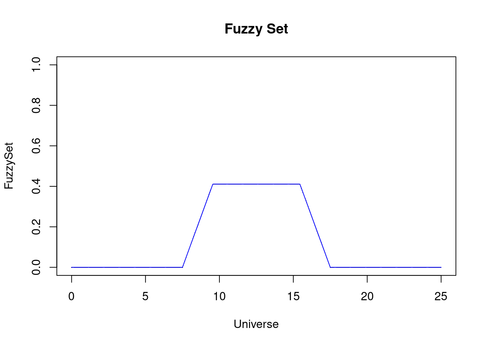
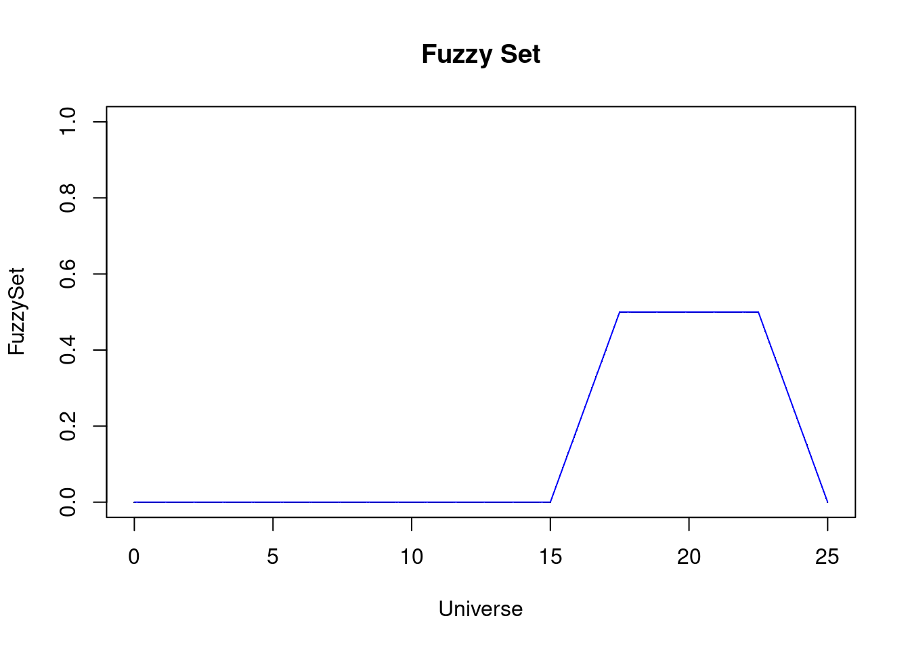
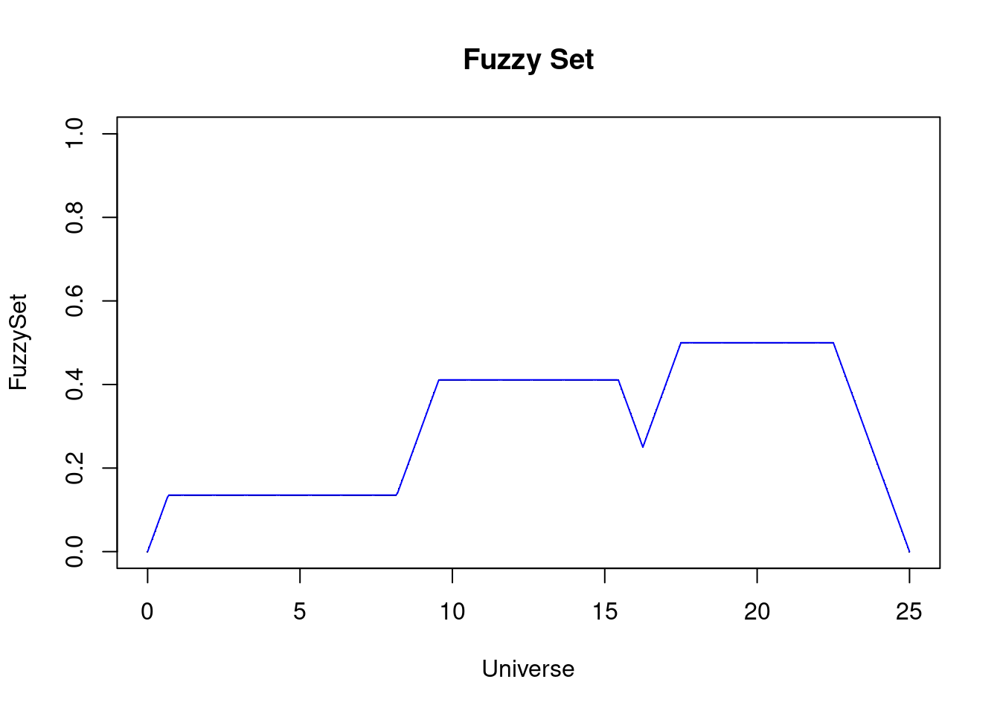

# FuzzyRulesFiles

## Lendo o código das funções

```r
install.packages("devtools")
library(devtools)

source_url("https://raw.githubusercontent.com/leapigufpb/FuzzyRulesFiles/refs/heads/main/srcR/FuzzyRules.R")
```

---

# MAIN PROGRAM - Exemplo de Dica com Conjuntos Fuzzy

Este exemplo é baseado no pacote `Sets` para R.  
Abaixo estão três variáveis linguísticas fuzzy:

- **Service**: tipo Gaussiano (`Poor`, `Good`, `Excelent`)
- **Food**: tipo trapezoidal (`rancid`, `delicious`)
- **Tip**: tipo triangular (`cheap`, `average`, `generous`)

---

## Criando Variáveis Fuzzy e Partições

### Definindo o Universo X

```r
minX = 0
maxX = 25
X <- Set.Universe(minX, maxX)
FRBS <- "Mamdani"
```

---

## Variável “Service”

```r
service.poor <- GauFS(X, 0.0, 1.5)
service.good <- GauFS(X, 5.0, 1.5)
service.excelent <- GauFS(X, 10, 1.5, alphamax = .3)

plotFS(X, service.poor, col = "blue")
par(new = TRUE)
plotFS(X, service.good, col = "red")
par(new = TRUE)
plotFS(X, service.excelent, col = "green")
```



---

## Variável “Food”

```r
food.rancid <- TraFS(X, 0, 0, 2, 4)
food.delicious <- TraFS(X, 7, 9, 10, 10)

plotFS(X, food.rancid, col = "blue")
par(new = TRUE)
plotFS(X, food.delicious, col = "red")
```



---

## Variável “Tip”

```r
tip.cheap <- TriFS(X, 0, 5, 10)
tip.average <- TriFS(X, 7.5, 12.5, 17.5)
tip.generous <- TriFS(X, 15, 20, 25)

plotFS(X, tip.cheap, col = "blue")
par(new = TRUE)
plotFS(X, tip.average, col = "red")
par(new = TRUE)
plotFS(X, tip.generous, col = "green")
```



---

# União, Interseção e Complemento

## Métodos de União e Interseção

Métodos disponíveis:

- Zadeh
- Probabilistic
- Lukasiewicz

```r
plotFS(X, uniFS(X, service.poor, service.good, method = "Zadeh"))
```



```r
plotFS(X, interFS(X, service.poor, service.good, method = "Zadeh"))
```



```r
plotFS(X, compFS(X, service.good))
```



---

# Definindo Entradas e Regras

## Definindo o Input

```r
service <- 3
food <- 8
```

---

## Criando Regras

### Regra 1

```r
temp <- OR(
  FRBS,
  dmFS(service, X, service.poor),
  dmFS(food, X, food.rancid)
)

fr1 <- Implication(FRBS, temp, X, tip.cheap)

plotFS(X, fr1)
```



```r
Out_Rules_Lst <- listfuzzy(fr1)
```

---

### Regra 2

```r
temp <- dmFS(service, X, service.good)

fr2 <- Implication(FRBS, temp, X, tip.average)

Out_Rules_Lst <- listfuzzy(Out_Rules_Lst, fr2)

plotFS(X, fr2)
```



---

### Regra 3

```r
temp <- OR(
  FRBS,
  dmFS(service, X, service.excelent),
  dmFS(food, X, food.delicious)
)

fr3 <- Implication(FRBS, temp, X, tip.generous)

Out_Rules_Lst <- listfuzzy(Out_Rules_Lst, fr3)

plotFS(X, fr3)
```



---

# Agregação e Defuzzificação

```r
OutFS <- Aggregation(FRBS, X, Out_Rules_Lst)

plotFS(X, OutFS)
```



```r
FinalDecision <- defuzzFS(
  X,
  OutFS,
  Out_Rules_Lst,
  method = "CoG"
)

cat("Resultado usando CoG: ", FinalDecision, "\n")
# Resultado usando CoG: 14.8859
```

```r
FinalDecision2 <- defuzzFS(
  X,
  OutFS,
  Out_Rules_Lst,
  method = "CoS"
)

cat("Resultado usando CoS: ", FinalDecision2, "\n")
# Resultado usando CoS: 14.75458
```

```r
FinalDecision3 <- defuzzFS(
  X,
  OutFS,
  Out_Rules_Lst,
  method = "CoLA"
)

cat("Resultado usando CoLA: ", FinalDecision3, "\n")
# Resultado usando CoLA: 20
```

---

# Conclusão

Esses cálculos ilustram o uso de conjuntos fuzzy e regras fuzzy para avaliar uma dica baseada na qualidade do serviço e da comida.